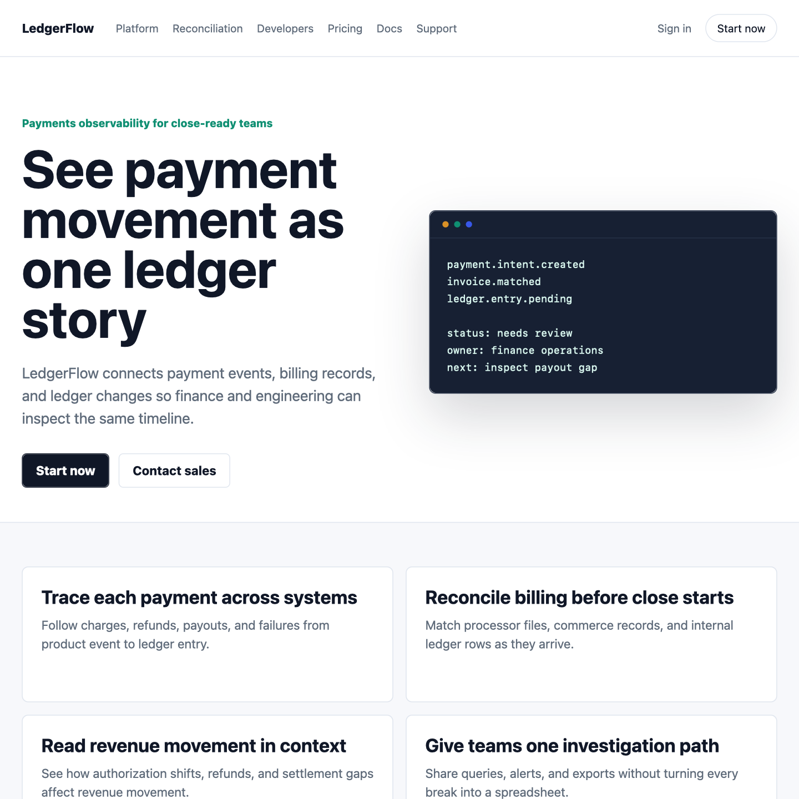

# Stripe SITE.md + VOICE.md Web Comparison

This comparison uses the same web-build prompt twice:

1. without context files;
2. with `packs/stripe/SITE.md` and `packs/stripe/VOICE.md` above the same prompt.

The goal is visible evidence. The context files should not merely improve a
copy score; they should change the page structure, information order, CTA
shape, and claim discipline in a way a builder can inspect.

## Visual Result

| Without context | With SITE.md + VOICE.md |
| --- | --- |
|  |  |

Open [preview.html](preview.html) to compare both pages side by side.

## Reference Fit

| Candidate | Reference fit | Structure | Voice | Copy safety | Claim safety | Mimic risk |
| --- | ---: | ---: | ---: | ---: | ---: | ---: |
| [without-context.html](without-context.html) | 63.2 | 74.5 | 49.2 | 100.0 | 50.0 | 0.0 |
| [with-site-voice.html](with-site-voice.html) | 92.1 | 95.8 | 89.4 | 100.0 | 75.0 | 0.0 |

`Reference fit` is not brand cloning. It rewards safe structure and copy
alignment while keeping `mimic risk` low.

## Files

- [prompt.md](prompt.md): shared prompt.
- [request-without-context.md](request-without-context.md): prompt only.
- [request-with-site-voice.md](request-with-site-voice.md): same prompt with context files.
- [without-context.html](without-context.html): visible result without context.
- [with-site-voice.html](with-site-voice.html): visible result with `SITE.md` and `VOICE.md`.
- [reference-fit.md](reference-fit.md): Markdown scoring report.
- [reference-fit.json](reference-fit.json): machine-readable scoring report.

## Reproduce

```bash
PYTHONPATH=src python3 scripts/reference_fit_report.py \
  --voice packs/stripe/voice.json \
  --site packs/stripe/site.json \
  --out examples/comparisons/stripe-ledgerflow-web/reference-fit.json \
  --markdown examples/comparisons/stripe-ledgerflow-web/reference-fit.md \
  examples/comparisons/stripe-ledgerflow-web/without-context.html \
  examples/comparisons/stripe-ledgerflow-web/with-site-voice.html
```

The scoring weights are:

- 45% structure fit;
- 45% voice fit;
- 5% copy safety;
- 5% claim safety.

This keeps the useful part of motif reproduction measurable without rewarding
source-copying or brand impersonation.
